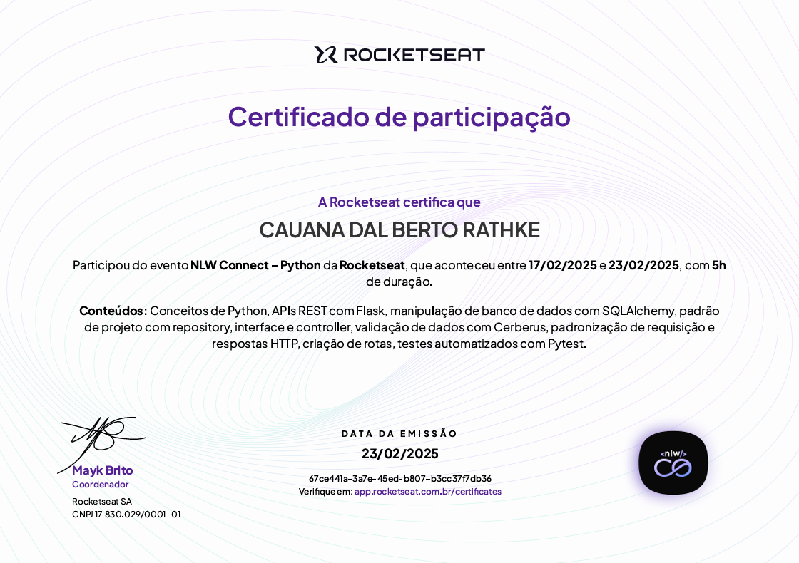

# 📅 Cadastro de Eventos

Este é um projeto de API para cadastro e gerenciamento de eventos, desenvolvido em Python.

## 🛠 Tecnologias Utilizadas
- [Flask](https://flask.palletsprojects.com/)
- [SQLAlchemy](https://www.sqlalchemy.org/)
- [pytest](https://docs.pytest.org/)
- [Cerberus](https://pypi.org/project/Cerberus/)
- [DBeaver](https://dbeaver.io/) 
- [Postman](https://www.postman.com/)
- [venv](https://pypi.org/project/virtualenv/)

---

## Criar e ativar o ambiente virtual (venv)

    # Criar o ambiente virtual
    python -m venv venv

    # Ativar o ambiente no Windows 
    . venv\Scripts\Activate.ps1
---
  
---
# 📄 [Certificado](https://app.rocketseat.com.br/certificates/67ce441a-3a7e-45ed-b807-b3cc37f7db36)

